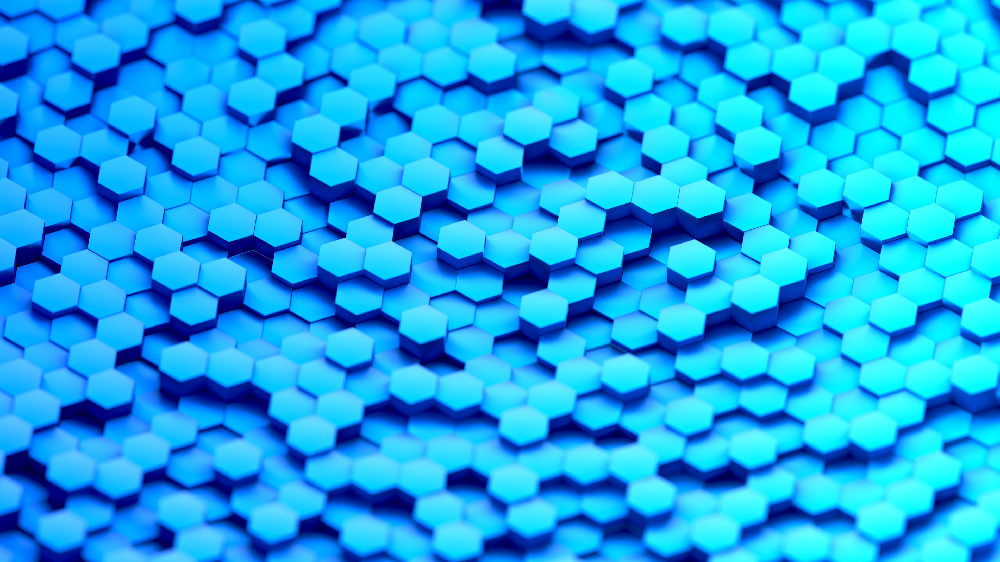

```toml
atom_id_parts = { email = "anna@annaaurora.eu", object = "55" }
title = "Hexagonal prism wallpaper"
date_published = "2021-08-29T00:00:00+00:00"
date_published_time_precision = false
keywords = ["hexagon-wallpaper", "hexagonal-prisms", "cgi"]
description = "A page featuring a cgi art piece and the software used to create it."
```


Created in Blender and rendered with it's Cycles engine.
