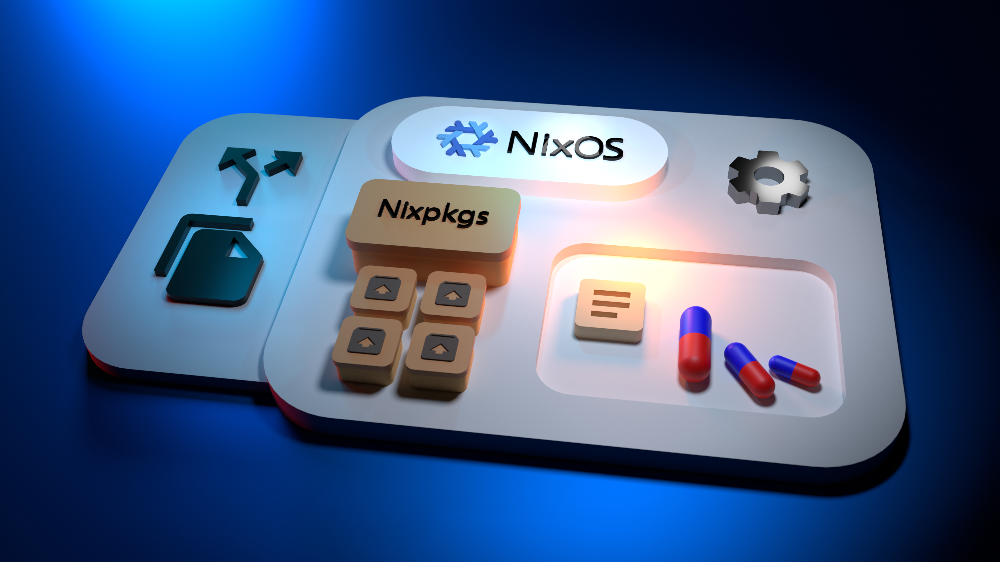

```toml
title = "NixOS 3d showcase"
date_published = "2021-06-05T00:00:00+00:00"
date_published_time_precision = false
keywords = ["wallpaper", "NixOS", "Nix", "Nixpkgs", "cgi"]
description = "A cgi art piece, the software and motivation for creating it."
```


I created this one in Blender as a background for my desktop. Blender's Cycles engine was used for rendering. It tries to showcase what [NixOS](https://nixos.org) is about.
