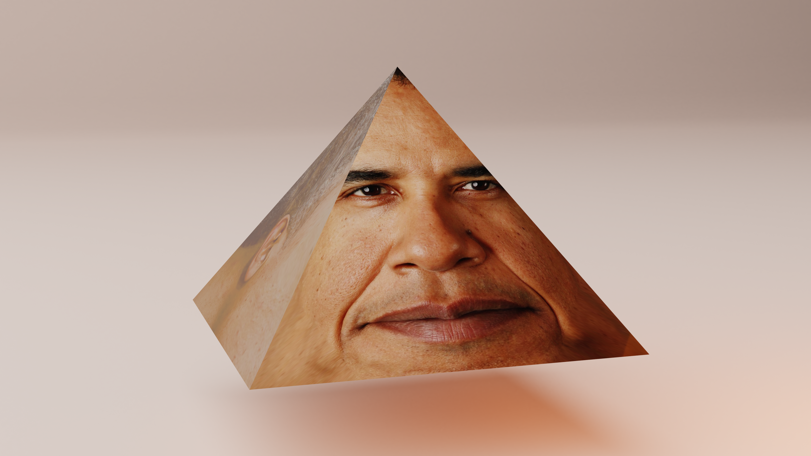

```toml
title = "👨🏾 Obama Prism"
date_published = "2020-05-26T00:00:00+00:00"
date_published_time_precision = false
keywords = ["meme", "barack-obama", "obama-prism", "image-projected-onto-3d-object", "cgi"]
description = "A cgi art piece leveling up the obama prism game to high-definition."

[atom_id_parts]
email = "anna@annaaurora.eu"
object = "0"
```


Yes, this is a meme.

Created using Blender and a high-resolution photo of Obama's face which was projected onto the sides of the pyramid.
